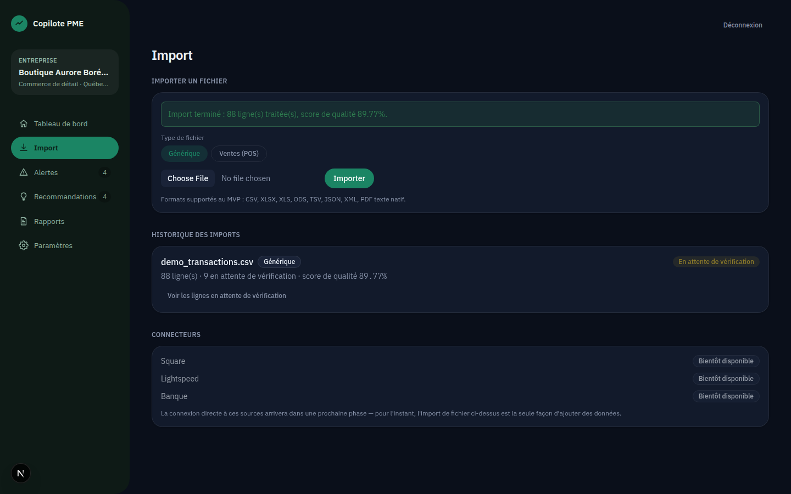
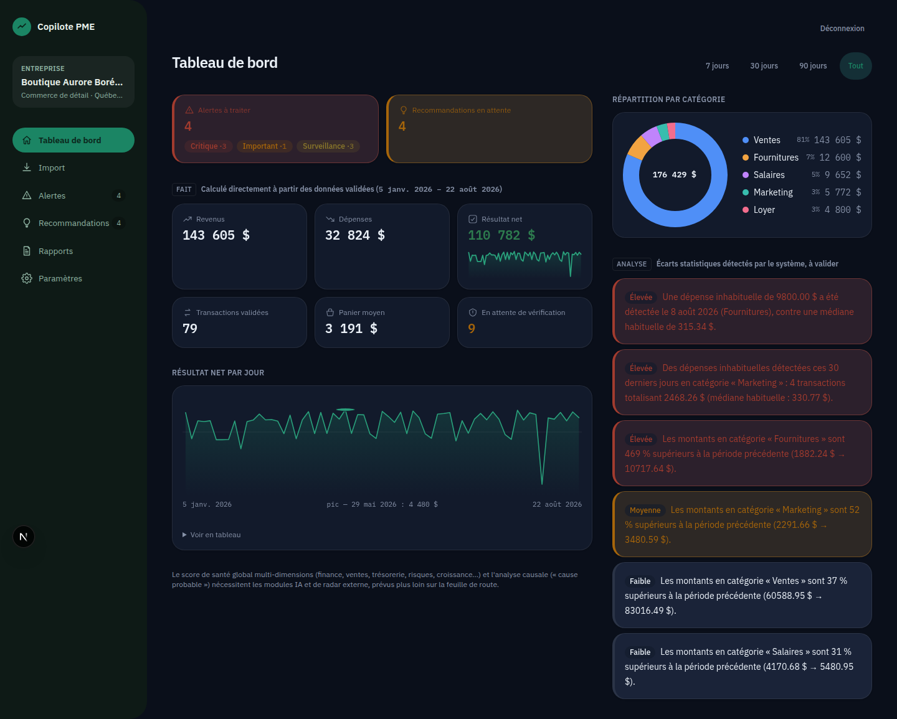
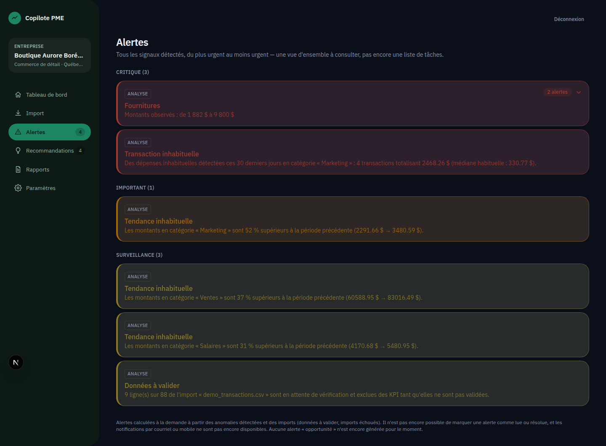
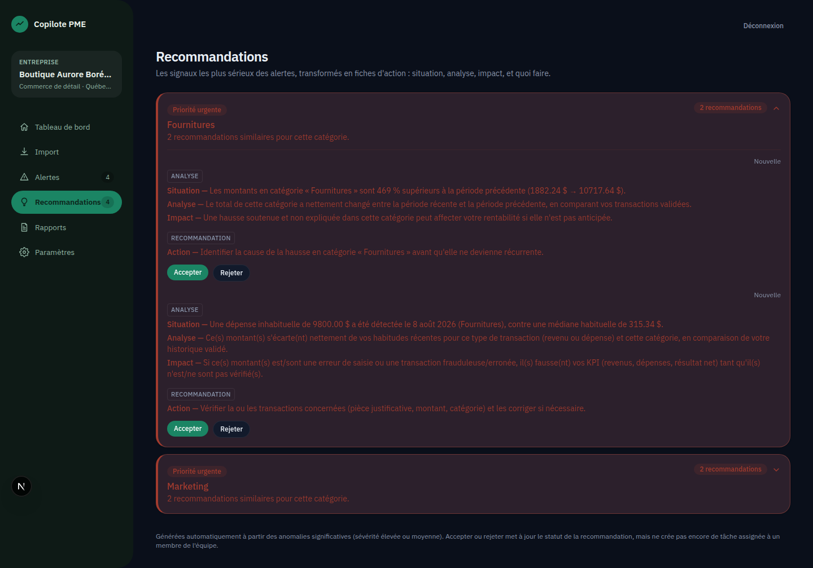

# Copilote PME

Système intelligent de pilotage, d'anticipation et d'aide à la décision pour petites entreprises.

> Projet personnel — conception produit (PRD complet) et développement d'un MVP full-stack.

## Le problème

Une petite entreprise (1 à 50 employés) fonctionne rarement avec un directeur financier, un analyste de données ou un responsable des opérations. Le propriétaire joue tous ces rôles lui-même, avec des données déjà présentes mais dispersées — Excel, comptabilité, banques, CRM, courriels — et sans le temps ni les outils pour les transformer en décisions.

## L'idée

Copilote PME connecte les données existantes d'une entreprise, les transforme automatiquement en diagnostic, et en tire des alertes, des anomalies et des recommandations d'action. L'objectif : donner à un propriétaire de PME la lucidité d'une petite équipe d'analystes qu'il n'a pas les moyens d'embaucher, sans remplacer ses outils actuels — une couche de pilotage au-dessus.

Chaque insight affiché est étiqueté selon son niveau de certitude (**fait / analyse / hypothèse / recommandation / prévision**), pour ne jamais présenter une supposition comme une vérité.

## Ce que couvre le projet

Le dépôt contient à la fois le cadrage produit et l'implémentation :

- **[PRD complet](PRD-Systeme-Pilotage-PME-v1.1%20%281%29.md)** — vision, périmètre MVP, modèle de données, roadmap en 4 phases, sécurité et conformité (Loi 25, résidence des données au Canada).
- **[Charte de projet](docs/project-charter.md)** — justification d'affaires, critères de succès, RACI, gestion des risques.
- **Un MVP en cours de développement** — authentification, création d'entreprise, import de fichiers (CSV/XLSX/PDF), dashboard, détection d'anomalies, recommandations, rapports et centre d'alertes.

## Aperçu

Import d'un fichier de transactions, dashboard généré automatiquement, détection d'anomalies et recommandations d'action — captures prises sur une instance locale avec des données de démonstration.

| Import & score de qualité | Dashboard |
|---|---|
|  |  |

| Alertes | Recommandations |
|---|---|
|  |  |

## Stack technique

| Couche | Technologie |
|---|---|
| Frontend | Next.js, TypeScript, Tailwind CSS |
| Backend | FastAPI (Python), SQLAlchemy, Alembic |
| Base de données | PostgreSQL |
| Traitement de données | pandas, pdfplumber, PyMuPDF, OCR (pytesseract) |
| Auth | JWT, Argon2 |
| Déploiement | Docker / docker-compose |

## Architecture du backend

Le backend expose une API REST organisée par domaine fonctionnel :

```
backend/app/routers/
├── auth.py             # authentification
├── companies.py        # gestion des entreprises
├── imports.py           # ingestion de fichiers (CSV, XLSX, PDF...)
├── dashboard.py         # santé de l'entreprise, KPI
├── anomalies.py         # détection d'anomalies
├── recommendations.py   # recommandations d'action
├── alerts.py            # centre d'alertes
└── reports.py           # rapports quotidien/hebdo/mensuel
```

## Frontend

Application Next.js (App Router) avec pages de connexion, de gestion des entreprises et de tableau de bord (`frontend/src/app/`).

## Démarrage local

```bash
cp backend/.env.example backend/.env
cp frontend/.env.example frontend/.env.local

# Base de données
docker compose up -d

# Backend (depuis backend/)
python -m uvicorn app.main:app --reload

# Frontend (depuis frontend/)
npm run dev
```

Le backend écoute par défaut sur `http://localhost:8000` ; `NEXT_PUBLIC_API_URL` côté frontend doit pointer vers cette URL.

## État du projet

Projet en développement actif. Le MVP (Phase 1 de la roadmap) couvre : configuration d'entreprise, ingestion de fichiers, dashboard, moteur d'analyse IA, rapports automatiques et assistant conversationnel. Les phases suivantes (OCR avancé, intégrations bancaires, prévisions, marketplace d'experts) sont documentées dans le PRD mais hors périmètre du MVP.

---

## Décisions clés

- **Modèle de données** : entreprises, imports, transactions, anomalies et recommandations comme entités séparées, pour permettre l'ajout de nouvelles sources d'ingestion sans toucher au moteur de détection.
- **Étiquetage de certitude** (fait / analyse / hypothèse / recommandation / prévision) sur chaque insight — un choix de produit pour éviter qu'une PME confonde une hypothèse avec un fait établi.
- **Ingestion multi-format découplée du moteur d'analyse**, pour que l'ajout d'un nouveau format de fichier n'exige pas de retoucher la détection d'anomalies.

Développé de bout en bout : cadrage produit (PRD, charte de projet), architecture technique, implémentation full-stack et suite de tests.
